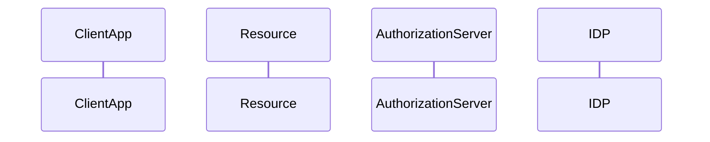

# Configurations

## Windows Terminal

### Color scheme

Setting [Cobalt2](https://github.com/Reidond/cobalt2-windows-terminal) theme for Windows Terminal

### How to update existing Git repository

…or push an existing repository from the command line

```bash
git remote add origin <https://github.com/anticam/configs.git>
git branch -M main
git push -u origin main
```

### Neovim

Install neovim

```bash
choco install neovim
```

check config path

```bash
:echo stdpath('config)
C:\Users\<user>\AppData\Local\nvim
```

put [init.lua](https://github.com/nvim-lua/kickstart.nvim/blob/master/init.lua) to config path

```bash
C:\Users\<user>\AppData\Local\nvim\init.lua
```

next start, plugins will be installed

### Git

Git installation, usage [GeeksForGeeks](https://www.geeksforgeeks.org/working-on-git-bash/)  
Git commands [rogerdudler.github.io/git-guide/](https://rogerdudler.github.io/git-guide/)  
| Task | Command | Description|
| --- | --- | --- |
| Initialize | `git init` | Initialize a new repository |
| Checkout | `git clone https://github.com/anticam/configs.git` | Clone a repository, a new folder configs created |
| Add a file | `git add main.cpp` | Add a single file (main.cpp) to the repository |
| Add all the files | `git add *`| Add all the files to the repository |
| Commit | `git commit -m "message"` | Commit to the HEAD. [Conventional commits](https://www.conventionalcommits.org/en/v1.0.0/#summary) |
| Push | `git push origin master` | Copy changes to remote repository |
| Connect | `git remote add origin <server>`| Connect to a remote repository |
| Branch | `git branch`| Show local branches |
| Branch | `git branch -r`| Show remote  branches |
| Branch | `git branch -a`| Show local and remote branches |
| Branch | `git checkout -b branch-name` | Create a new branch |
| Branch | `git  checkout branchname`| Switch to branch "branchname" |
| Branch master | `git checkout master` | Switch to master branch |
| Delete branch | `git branch -d branch-name` | Delete branch |
| Push branch | `git push origin branch` | Branch is available in remote repository |
| Pull | `git pull`| Update local repository from remote server. (fetch + merge) |
| Merge | `git merge branch` | Merge branch into active branch, includes all the Git commits in the history of target branch. |
| Diff | `git diff source target` | Compare changes between source and target branches |
| Log | `git log --author=user` | Logs |
| Log | `git log --author=user` ||
| Log | `git log --name-status` ||
| Log | `git log --graph --format=format:'%C(bold blue)%h%C(reset) - %C(bold green)(%ar)%C(reset) %C(white)%an%C(reset)%C(bold yellow)%d%C(reset) %C(dim white)- %s%C(reset)' --all'` ||
| Replace | `git checkout -- filename`| Replace a local file |
| Drop | `git fetch origin` <br>  `git reset --hard origin/master` | Drop all the local changes |
| Show| `git show <commit> --stat`| Show what happened in a specific commit |
| Show | `git show <commit> -- <path to file>`| Show changes in a specific file |
| Squash | | [merge vs squash](https://betterprogramming.pub/why-i-prefer-regular-merge-commits-over-squash-commits-cadd22cff02c). Flattens all the Git commits to one commit in the target branch. |
| Trace | GIT_TRACE<br>`GIT_TRACE=1 git commit -m "message"` | for general traces|
| Trace | GIT_TRACE_PERFORMANCE | for logging the performance data |
| Trace | GIT_CURL_VERBOSE | for logging all curl messages, `curl -v` |

[Getting Started with Git and GitHub Part 1: Intro to Git and GitHub](https://dev.to/danielstai/getting-started-with-git-and-github-part-1-intro-to-git-and-github-k7a)
[Git stash](<https://www.atlassian.com/git/tutorials/saving-changes/git-stash>)
[Git Internals - Environment Variables](https://git-scm.com/book/en/v2/Git-Internals-Environment-Variables#Debugging)

### Oh My Posh

Oh My Posh [pure](https://ohmyposh.dev/docs/themes) theme

```powershell
choco install oh-my-posh
```

#### Font

[Cascadia Code Font](https://github.com/microsoft/cascadia-code)  
[Cascadia Code Nerd Font](https://github.com/AaronFriel/nerd-fonts/releases/tag/v1.2.0)  
[Caskaydia Cove Nerd Font](https://www.nerdfonts.com/font-downloads)  
[JetBrains Mono Nerd Font](https://www.nerdfonts.com/font-downloads)
[JetBrains Mono Font](https://www.jetbrains.com/lp/mono/)  
[Tech Craft My FAVORITE Font for Coding & Terminal Use](https://www.youtube.com/watch?v=yKjpUCCyHu8)

```powershell
choco install cascadia-code-nerd-font
```

### Chrome Extensions
JSON Viewer Pro : https://chrome.google.com/webstore/detail/json-viewer-pro/eifflpmocdbdmepbjaopkkhbfmdgijcc  
JSON Viewer : https://chrome.google.com/webstore/detail/json-viewer/gbmdgpbipfallnflgajpaliibnhdgobh  


### PowerShell

```powershell
code $profile
```

Microsoft.PowerShell_profile.ps1

```powershell
oh-my-posh init pwsh --config $env:POSH_THEMES_PATH\pure.omp.json | Invoke-Expression
```

POSH_THEMES_PATH points to C:\Program Files (x86)\oh-my-posh\themes

### Git Bash

In home directory edit .bashrc

```bash
eval "$(oh-my-posh --init --shell bash --config '/c/Program Files (x86)/oh-my-posh/themes/pure.omp.json')"
```

### VSCode

Extensions
| Name | link | Description |
| --- | --- | --- |
| Live Server | --- | --- |
| SAP HANA Database Explorer | [blog](https://blogs.sap.com/2022/01/26/sap-hana-database-explorer-vscode-extension-getting-started-tips/) | --- |
| Cobalt2 | --- | color theme |
| CodeSnap |||
| Community Material Theme |||
| Markdown Preview Enhanced |||
| Material Theme |||
| PolaCode || polaroid of your code |
| Rest Client |||

## Tutorials

Zero-to-mastery [resources](https://github.com/zero-to-mastery/resources)

### JavaScript

The Net Ninja - Async JavaScript [Tutorial](https://www.youtube.com/playlist?list=PL4cUxeGkcC9jx2TTZk3IGWKSbtugYdrlu) 2020  

Pluralsight - [JavaScript Promises and Async Programming](https://app.pluralsight.com/library/courses/javascript-promises-async-programming/table-of-contents)
github - [samples](https://github.com/taylonr/async-programming-promises)  
Pluralsight - [JavaScript 2018 Variables and Types](https://app.pluralsight.com/library/courses/javascript-variables-types/table-of-contents)
github - [samples](https://github.com/bmaluijb/GetYourLoanApp)  
Pluralsight - [JavaScript: Getting Started](https://app.pluralsight.com/library/courses/javascript-getting-started/table-of-contents)  
Pluralsight - [JavaScript Fundamentals](https://app.pluralsight.com/library/courses/javascript-fundamentals/table-of-contents) github [samples](https://github.com/wbkd/webpack-starter)

### BAS generators

SAP Business Technology Platform - [Extension Generators](https://www.youtube.com/playlist?list=PLkzo92owKnVwQ-0oT78691fqvHrYXd5oN)
[HANA Academy](https://github.com/saphanaacademy/generator-saphanaacademy-cap)

```bash
npm install -g yo
npm install -g generator-saphanaacademy-cap
```

### Code with Brandon

[SAP UI5](https://www.youtube.com/watch?v=mmSB85rWQ3w&list=PL1c8MA5nHXbokyx1fdMWDbhGtxvLBbW8_)  
SAP Gateway  
[SAP ABAP CDS](https://www.youtube.com/watch?v=h2149dCi0Cw&list=PL1c8MA5nHXbo-OO9e58FkMWZklwIkQyj4)  

### Dani Krossing

[JavaScript Tutorials](https://www.youtube.com/playlist?list=PL0eyrZgxdwhxNGMWROnaY35NLyEjTqcgB)  

### freeCodeCamp.org

[Learn React from Three All-Star Instructors](https://www.freecodecamp.org/news/learn-react-from-three-all-star-instructors/)  
[React JavaScript Framework for Beginners – Project-Based Course 08:30](https://www.youtube.com/watch?v=u6gSSpfsoOQ)  

### Code with Ania Kubóv

[YouTube](https://www.youtube.com/c/AniaKub%C3%B3w)

#### Playlists

| Title | --- | --- |
| --- | --- | --- |
| SAP Developers - SAP Business Applicaition Studio [playlist](https://www.youtube.com/playlist?list=PL6RpkC85SLQCj7Q8438pHCKH30qd2bHp2) | --- | --- |
| SAP Tech Videos - SAPUI5 [playlist](https://www.youtube.com/playlist?list=PLp5jfhnBM-twLxlydcJBKNdng4UXcAsj5) | --- | --- |
| SAP TechEd 2020 - Application Development and Integratoin Track [playlist](https://www.youtube.com/playlist?list=PLI96yWErnX_o1xhc6t_oSY0VqyeTzQbNq) | --- | --- |
| SAP TechEd in 2020 - Firoir Apps [playlist](https://www.youtube.com/playlist?list=PLpQebylHrdh7zle6thIVZ2R3c8UennSBD) | --- | --- |
| OpenUI5 - [videos](https://www.youtube.com/c/openui5videos) | --- | --- |
| OpenUI5 Rise Your Skills [playlist](https://www.youtube.com/playlist?list=PLHUs_FUbq4dXG1m-pZdkXgRsNUBZtfmrj) | --- | *** |
| 10 min IT tutorials - SAPUI5 - From beginnter to expert [playlist](https://www.youtube.com/playlist?list=PLKSPsENL3Cxwsrzj55poGoS9Bfv6wGLgb) | --- | --- |

#### Samples

Developers
| Title | Year | Description |
| --- | --- | --- |
| Set Up SAP Business Application Stuido for Development [link](https://developers.sap.com/tutorials/appstudio-onboarding.html)| --- | --- |
| [Configure a List Report Page Using SAP Fiori Tools](https://developers.sap.com/tutorials/fiori-tools-configure-lrop.html) | --- | --- |
| CAP samples [github](https://github.com/SAP-samples/cloud-cap-samples) | --- | --- |
| [Get Started with the SAP HANA Database Explorer](https://developers.sap.com/group.hana-cloud-get-started.html) | --- | --- |
| [WebSocket RFC to Cloud Using SAP Business Connector](https://developers.sap.com/tutorials/abap-websocket-rfc-bc.html) | 2022 | --- |
| [SAP BTP: Application Development and Integration](https://www.youtube.com/playlist?list=PL6RpkC85SLQAgUp1CE8YFr6ByfHw8y3eu) | --- | --- |

#### OpenSAP

Courses
| Title |Year| Description|
| --- | --- | --- |
| [Working with Calculation View in SAP HANA Cloud](https://open.sap.com/courses/hana9) | 09.2022 | #HANA |
| [Ride the SAP HANA Wave: Fundamentals and Insights into Cloud Databases](https://open.sap.com/courses/hana8) | 04.2022 | #HANA, #Cloud |
| [Software Development on SAP HANA (Update Q1/2019)](https://open.sap.com/courses/hana7) | 02.2019 | #HANA|
| [Sofware Development on SAP HANA (Update Q4/2017)](https://open.sap.com/courses/hana6) | 12.2017 | #HANA |
| [Software Development on SAP HANA (Update Q4/2016)](https://open.sap.com/courses/hana5) | 12.2016 | #HANA |
| [Software Development on SAP HANA (Delta SPS11)](https://open.sap.com/courses/hana4) | 04.2016 | #HANA |
| [Software Development on SAP HANA (Delta SPS09)](https://open.sap.com/courses/hana3) | 05.2015 | #HANA |
| [Next Steps in Software Development on SAP HANA](https://open.sap.com/courses/hana2) | 11.2014 | #HANA |
| [introduction to Software Development on SAP HANA](https://open.sap.com/courses/hana1) | 07.2013 | #HANA |
| [Building Applications with SAP CAP](https://open.sap.com/courses/cp7) | 05.2020 | #CAP |

#### CAP Java

| Title | Year | Description |
| --- | --- | --- |
| [CAP JAVA - initialization, creating a model API testing](https://medium.com/nerd-for-tech/sap-tutorial-complete-cap-java-part-1-fc1868c7bbba) | --- | --- |
| [CAP Java Part 2](https://medium.com/nerd-for-tech/sap-tutorial-complete-cap-java-part-2-217bc930857d) | --- | --- |
| [CAP Java Part 3](https://medium.com/nerd-for-tech/sap-tutorial-complete-cap-java-3-adec221180bb) | --- | --- |
| [CAP Java Part 4](https://medium.com/nerd-for-tech/sap-tutorial-complete-cap-java-4-6938e419f575) | --- | --- |
| [CAP Java Part 5](https://medium.com/nerd-for-tech/sap-tutorial-complete-cap-java-part-5-fb3ff81e64c1) | --- | --- |
| [CAP Java Part 6](https://medium.com/nerd-for-tech/sap-tutorial-complete-cap-java-part-6-81e9e867bc60) | --- | --- |
| [CAP Java Part 7](https://bnheise.medium.com/sap-tutorial-complete-cap-java-part-7-eba7169b38fd) | --- | --- |
| [CAP Java Part 8](https://bnheise.medium.com/sap-tutorial-complete-cap-java-8-a9425288706c) | --- | --- |
| [CAP Java Part 9](https://bnheise.medium.com/custom-actions-in-cap-java-2-fd84b6b3720a) | --- | --- |
| [CAP Java Part 10](https://bnheise.medium.com/sap-tutorial-complete-cap-java-part-10-83051005d521) | --- | --- |
| [CAP Java Part 11](https://bnheise.medium.com/sap-tutorial-complete-cap-java-11-cbfb5deb69d2) | --- | --- |
| [CAP Java Part 12](https://bnheise.medium.com/sap-tutorial-complete-cap-java-part-12-e9a4c8a7b1ce) | --- | --- |
| [CAP Java Part 13](https://bnheise.medium.com/sap-tutorial-complete-cap-java-13-3367ca3c64e5) | --- | --- |
| [CAP Java Part 14](https://bnheise.medium.com/sap-tutorial-complete-cap-java-14-4888ce2f7d45) | --- | --- |
| [CAP Java Part 15](https://bnheise.medium.com/sap-tutorial-the-complete-cap-java-part-15-5e3b17342732) | --- | --- |

### Kyma

<https://github.com/SAP-samples/kyma-runtime-extension-samples>

### Web Development

| Site | Description| --- |
| --- | --- | --- |
| [HTML For Beginners The Easy Way: Start Learning HTML & CSS Today](https://html.com) | --- | --- |
| [The Modern JavaScript Tutorial](https://javascript.info/) | --- | --- |
| [DigitalOcean css-tricks.com](https://css-tricks.com/) | --- | --- |
| [php.net](https://www.php.net/) | --- | --- |
| [bootstrap](https://getbootstrap.com/) | --- | --- |
| [React Tutorial](https://react-tutorial.app/) | --- | --- |
| [Algorithm Visualizer](https://algorithm-visualizer.org/) | --- | --- |
| [Learn Git Branching](https://learngitbranching.js.org/) | --- | --- |
| [MySQL](https://www.mysql.com/) | --- | --- |

### Rust

Pluralsight [Rust Fundamentals](https://app.pluralsight.com/library/courses/fundamentals-rust/table-of-contents)

## Docker

### Download docker images

Docker commands
| Task | Command | Description |
| --- | --- | --- |
| pull latest images | `sudo docker-compose pull` | --- |
| start an update new containers | `sudo docker-compose up -d` | --- |
| remove orphaned images | `docker system prune` | --- |
| remove dangling and unused images | `sudo docker image prune -a` | --- |

## Tools

### Windows

#### Chocolatey

Chocolatey [installation steps](https://chocolatey.org/install)

Tool list
| Name | Command | Description |
| --- | --- | --- |
| [Advanced IP Scanner](https://www.advanced-ip-scanner.com/)| `choco install advanced-ip-scanner` | |
| [Cascadia Font Nerd](https://www.nerdfonts.com/font-downloads) | `choco install cascadia-code-nerd-font` | --- |
| [CMake](https://cmake.org/cmake/help/v2.8.1/cmake.html) | `choco install cmake`  | --- |
| [DBeaver](https://dbeaver.io/) | `choco install dbeaver` | --- |
| [Ditto Clipboard](https://ditto-cp.sourceforge.io/) | `choco install ditto` | --- |
| [Everything](https://www.voidtools.com/) | `choco install everything`| --- |
| [Git](https://gitforwindows.org/) | `choco install git` | Git Bash, openssl |
| [Gradle](https://gradle.org/) | `choco install gradle` | --- |
| [Kubelogin (CLI)](https://github.com/int128/kubelogin) | `choco install kubelogin` | `kubectl oidc-login` |
| [Kubernetes CLI](https://kubernetes.io/) | `choco install kubernetes-cli` | Google |
| [helm](https://helm.sh/) | `choco install kubernetes-helm` | --- |
| [Insomnia](https://insomnia.rest/) | `choco install insomnia-rest-api-client`| REST client |
| [JetBrains IntelliJ IDEA (Community Edition)](https://www.jetbrains.com/idea/) | `choco install intellijidea-community` ||
| [JetBrains Mono Nerd Font](https://www.nerdfonts.com/) | `choco install jetbrainsmononf` | |
| [JetBrains PyCharm (Community Edition)](http://www.jetbrains.com/pycharm/) | `choco install pycharm-community`| JetBrains Python IDE |
| [JXplorer](http://jxplorer.org/) | `choco install jxplorer` | Java LDAP client |
| [Keystore explorer](http://keystore-explorer.org/) | `choco install keystore-explorer.portable` ||
| [Maven](https://maven.apache.org/) | `choco install maven` | --- |
| [Miller](https://github.com/johnkerl/miller) | `choco install miller` | CSV tool |
| [MQTT-Explorer](http://mqtt-explorer.com/) | `choco install mqtt-explorer` | MQTT Explorer |
| [Nmap](https://nmap.org/) | `choco install nmap` | network tool |
| [Notepad++](https://notepad-plus-plus.org/) | `choco install notepadplusplus` | --- |
| [Notepad++ plugin manager](https://github.com/chtof/chocolatey-packages/tree/master/automatic/notepadplusplus-npppluginmanager) | `choco install npppluginmanager` | --- |
| [Obsidian](https://obsidian.md/) | `choco install obsidian` | Note organizer |
| [Oh-My-Posh](https://ohmyposh.dev/) | `choco install oh-my-posh` | --- |
| [Pack](https://github.com/buildpacks/pack) | `choco install pack` | buildpack CLI |
| [Postman for Windows](https://www.postman.com/) | `choco install postman` ||
| [Python 3.x](https://www.python.org/downloads/) | `choco install python3`| ---|
| [SAPMachine JDK 11](https://sap.github.io/SapMachine/) | `choco install sapmachine11` | --- |
| [SAPMachine JDK 13](https://sap.github.io/SapMachine/) | `choco install sapmachine13` | --- |
| [SAPMachine JDK 17](https://sap.github.io/SapMachine/) | `choco install sapmachine17` | --- |
| [SAPMachine JDK 19](https://sap.github.io/SapMachine/) | `choco install sapmachine` | --- |
| [Screenpresso](https://www.screenpresso.com/) | `choco install screenpresso` | Capture tool |
| [Sizer](http://www.brianapps.net/sizer4/) | `choco install sizer` | Window resizer |
| [Tabby](https://github.com/Eugeny/tabby) | `choco install tabby` | terminal software |
| [TightVNC](https://www.tightvnc.com/)| `choco install tightvnc` | VNC client |
| [Treesize free](https://www.jam-software.com/treesize_free) | `choco install treesizefree` | Folder allocation |
| [VSCode](https://code.visualstudio.com/) | `choco install vscode` | --- |
| [Visual Studio 2022 Community](https://visualstudio.microsoft.com/) | `choco install visualstudio2022community`||
| [Windows Terminal](https://github.com/microsoft/terminal) | `choco install microsoft-windows-terminal` | Recommended to install from [Microsoft Store](https://aka.ms/terminal) |
| [WinSCP](https://winscp.net/eng/download.php) | `choco install winscp` | --- |
| [Wireshark](https://www.wireshark.org/) | `choco install wireshark` | Network sniffer |
| [XCA](https://www.hohnstaedt.de/xca/) | `choco install xca` | Certificate and key manager |
| [Yarn](https://yarnpkg.com/) | `choco install yarn`| package manager |

Choco commands
| Task | Command | Description |
| --- | --- | --- |
| list installed packages | `choco list --localonly` | --- |
| list outdated packages | `choco outdated` | --- |
| upgrade one package | `choco upgrade <package>` | ---|
| upgrade all packages | `cup all -y`| --- |

#### Cloud Foundry

CF CLI tools

Install CF CLI
[CloudFoundry/CLI](https://github.com/cloudfoundry/cli)

or with Chocolatey

```powershell
choco install cloudfoundry-cli
```

Add the community repository in CF CLI

```powershell
cf add-plugin-repo CF-Community <https://plugins.cloudfoundry.org>
```

Plugins
| Plugin | Command | Description |
| --- | --- | --- |
|[service manager](https://github.com/SAP/cf-cli-smsi-plugin)|  `cf install-plugin service-management` | service manager installation|
| [multiapps](https://github.com/cloudfoundry/multiapps-cli-plugin) | `cf install-plugin multiapps` | multiapps installation |

Tasks
| Task | Command | Description |
| --- | --- | --- |
| look for outdated plugins | `cf plugins --outdated` | --- |
| update plugin | `cf install-plugin <name>` | --- |

#### Cloud MTA Build Tool

[Installation steps](https://sap.github.io/cloud-mta-build-tool/download/)

#### BTP

BTP CLI for Feature set B
[Tool](https://tools.hana.ondemand.com/#cloud)

### Test sites, tools

[mockapi.io](https://mockapi.io) API endpoint with random data  
JavaScript obfuscator  

- <https://javascriptobfuscator.com/>  
- <https://obfuscator.io/>  

## Resources

Community - [Cloud SDK](https://community.sap.com/topics/cloud-sdk)
[Cloud SDK](https://sap.github.io/cloud-sdk/)
[CAP](https://cap.cloud.sap/docs/)
[BTP Community](https://community.sap.com/topics/business-technology-platform)

[SAPUI5](https://sapui5.hana.ondemand.com/sdk/#/topic/5fe439613f9c4e259015951594c423dc.html)

Tutorial - [Create Database Artifactes Using CDS for SAP HANA Cloud](https://developers.sap.com/tutorials/hana-cloud-cap-create-database-cds.html)

### Online Tools

[Codepen](https://codepen.io/pen/)
[CodeSandbox](https://codesandbox.io/)
[JSPen](https://jspen.co/home)
[PlayCode](<https://playcode.io/>)
[RunJS](https://runjs.co/)
[Plunker](https://plnkr.co/)

### Curl

curl samples [Reqbin.com](https://reqbin.com/req/c-haxm0xgr/curl-basic-auth-example)  

### XSA

XSA HANA Academy [playlist](https://www.youtube.com/playlist?list=PLkzo92owKnVwL3AWaWVbFVrfErKkMY02a)

### Password generators

#### Ubuntu

<https://itsfoss.com/password-generators-linux/>

pwgen

```bash
sudo apt install pwgen

pwgen
Zeihied3 rie4eiPh ChuG2ua5 coh8UGai aeF2eepa aiPee0ya erohD6va aPah7oaz
AX3cihag Nei5gie8 ooveeR3i Eel3shu2 Bah4eoph Quiefuu5 IuF6ooph es1Raeri
chef8huF bahh9ahP Juko8oe2 yaaPhee4 eehohr2I Quahqui0 Iet8aeZo oCoh2eel
```

xkcdpass

```bash
sudo apt install xkcdpass

xkcdpass
supreme overlord proven tipping purge outflank
```

diceware

```bash
sudo apt install diceware

diceware
FidelityCringingCollideJiffyAvidVertical
```

### NPM

Versioning
major.minor.patch
express 4.17.3

Manual package update

```bash
npm outdated
npm update
```

Automatic minor/patch update

```bash
express ^4.17.3
caret updates minor

express ~4.17.3
tiled updates patch
```

### CLI tools

```bash
sudo apt install figlet
figlet hello

 _   _ _____ _     _     ___
| | | | ____| |   | |   / _ \
| |_| |  _| | |   | |  | | | |
|  _  | |___| |___| |__| |_| |
|_| |_|_____|_____|_____\___/


sudo apt install cmatrix

sudo apt install hollywood

sudo apt install libaa-bin
aafire

sudo apt install rig

telnet telehack.com
.starwars

telnet mpascii.me

telnet freechess.org
```

### Markdown

[Markdown Style Guide](https://cirosantilli.com/markdown-style-guide/#option-code-fenced)
[Rules](https://github.com/DavidAnson/markdownlint/blob/v0.26.2/doc/Rules.md#md033)
[Arctic Ice Code Style](https://arcticicestudio.github.io/styleguide-markdown/rules/code.html)

### Links

OAuth2 [Authentication flows](./authflows.md)  
Docker setup [docker-compose](./docker.md)  
Projects [projects](./projects.md)  
[Protocols](./protocols.md)  
[Bench](./bench.md)  


