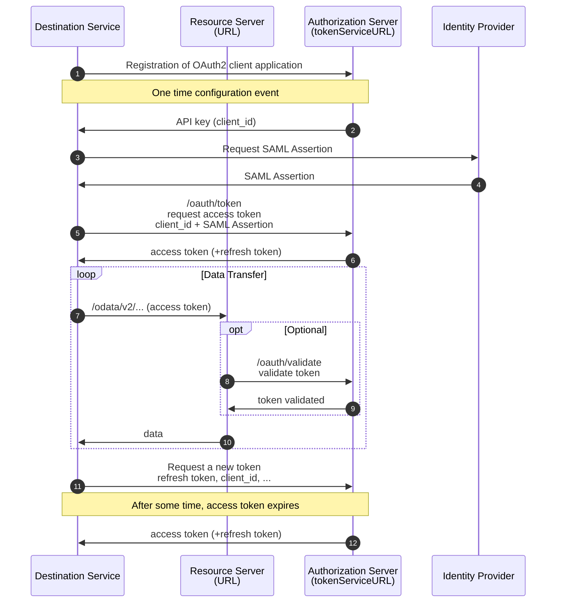

# Authentication Flows

## Oauth2

### OAuth2 flows

[Cloud Foundry Authorization](https://docs.cloudfoundry.org/api/uaa/version/76.3.0/index.html#overview)  
[Oauth 2.0 and Open ID Connect](https://learn.microsoft.com/hu-hu/azure/active-directory/develop/v2-oauth2-auth-code-flow)
[OAuth2SAMLBearerAssertion Flow](https://blogs.sap.com/2021/03/26/oauth2samlbearerassertion-flow-with-the-sap-btp-destination-service./)

### OAuth2SAMLBearerAssertion

